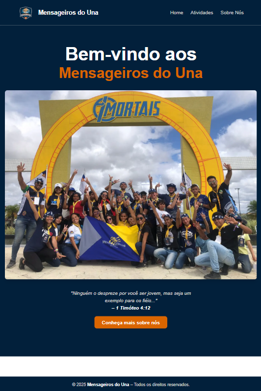

<div align="center">
  

  # Mensageiros do Una 🌟

  📍 Palmares–PE | 9ª Região | APE  
  🏕 1 Timóteo 4:12  
  💒 IASD – A mensagem do advento a todos em minha geração.
</div>

---

## ✨ Visão Geral

Este é o site oficial do **Clube de Desbravadores Mensageiros do Una**, desenvolvido com **Next.js 14 (App Router)**, com o objetivo de apresentar as atividades, fotos, vídeos e história do clube.

O projeto foi criado com foco em design responsivo, animações modernas e navegação intuitiva, sendo facilmente acessível em celulares, tablets e desktops.

---

## 🚀 Tecnologias

- [Next.js 14](https://nextjs.org/)
- [React](https://reactjs.org/)
- [Tailwind CSS](https://tailwindcss.com/)
- [Framer Motion](https://www.framer.com/motion/)
- [Lucide Icons](https://lucide.dev/)

---

## 📸 Funcionalidades

✅ Página Inicial com mensagem animada e fundo personalizado  
✅ Menu responsivo com botão hamburguer e efeito click-outside  
✅ Galeria de **fotos e vídeos** em abas separadas  
✅ Página "Sobre Nós" com informações do clube e **efeito scroll reveal**  
✅ Cores oficiais: `#02203b`, `#da650c`, `#d5d2d1`, `#fff`

---

## 🖼️ Demonstração

🔗 Acesse agora: [mensageiros-do-una-site.vercel.app](https://mensageiros-do-una-site.vercel.app/)



---

## 🛠️ Como rodar localmente

```bash
# Clone o repositório
git clone https://github.com/robsonalbuquerquedev/mensageiros-do-una-site.git

# Acesse a pasta
cd mensageiros-do-una-site

# Instale as dependências
npm install

# Rode o projeto
npm run dev
```

O site ficará disponível em http://localhost:3000

---

## 📅 Informações do Clube

- Classificação: ⭐⭐⭐ Três Estrelas
- Fundação: 30 de março de 2002
- Endereço: Rua Doutor Leopoldo Lins, 191 – Palmares – PE
- Reuniões: Domingos às 09:30

## 👨‍💻 Desenvolvedor

Feito com carinho por Robson Albuquerque

## 📄 Licença

Este projeto está licenciado sob a [MIT License](LICENSE).
